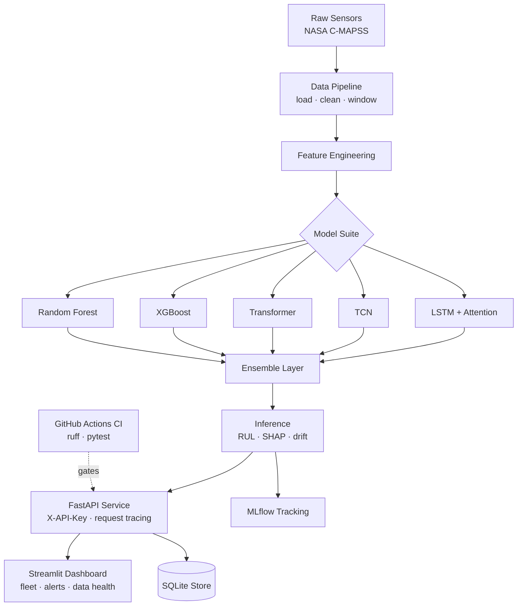

```
   ____            _   _            _    _    ___
  / ___|  ___ _ __ | |_(_)_ __   ___| |  / \  |_ _|
  \___ \ / _ \ '_ \| __| | '_ \ / _ \ | / _ \  | |
   ___) |  __/ | | | |_| | | | |  __/ |/ ___ \ | |
  |____/ \___|_| |_|\__|_|_| |_|\___|_/_/   \_\___|

```

# SentinelAI: Aviation Turbofan Engine Predictive Maintenance Platform

[](https://github.com/Arnavs-7/Sentinelai/actions/workflows/ci.yml)
[](#testing)
[](https://sentinelai-hfzx9bnwh6kzsuwkottn8v.streamlit.app)
[](https://www.python.org/)
[](#license)
[](https://fastapi.tiangolo.com/)
[](https://pytorch.org/)

> **Aviation Turbofan Engine Predictive Maintenance Platform**

Built on the **NASA C-MAPSS turbofan degradation dataset**. Designed for
aviation MRO teams to predict engine failures before they occur.

---

## Problem Statement

Unplanned equipment failure is one of the most expensive problems in modern
industry. Across manufacturing, aviation, energy, and heavy machinery sectors,
unexpected downtime, emergency repairs, and collateral damage cost businesses
hundreds of billions of dollars every year. A single failed turbine, compressor,
or production line can halt operations for days, void warranties, and put worker
safety at risk. The cost is rarely the broken part itself — it is the cascade of
lost output, expedited logistics, and idle labor that follows.

Traditional condition monitoring relies on fixed thresholds: an alarm fires only
once a sensor crosses a hard limit. By the time a temperature, vibration, or
pressure reading breaches that limit, the underlying degradation is often already
severe and the remaining window for a planned intervention has closed. Static
thresholds cannot capture the slow, multivariate drift that precedes most
mechanical failures, and they generate noisy false alarms while missing the
gradual patterns that actually matter.

SentinelAI replaces reactive thresholds with predictive intelligence. It learns
the degradation signatures of equipment directly from historical sensor data and
estimates the **Remaining Useful Life (RUL)** of each machine — how many operating
cycles remain before failure. By combining deep sequence models, gradient-boosted
trees, and an ensemble layer, SentinelAI forecasts failures days or weeks in
advance, quantifies uncertainty, explains every prediction, and surfaces it all
through a REST API and an interactive dashboard so maintenance can be scheduled
*before* the breakdown.

---

## Architecture



---

## Features

- ✅ **RUL prediction** — forecast remaining useful life per machine
- ✅ **Anomaly detection** — autoencoder-based reconstruction scoring
- ✅ **Batch scoring** — JSON batch and CSV-upload prediction endpoints
- ✅ **SHAP explainability** — per-prediction feature attributions
- ✅ **Drift detection** — KS test, PSI, and concept-drift monitoring
- ✅ **REST API** — FastAPI service with OpenAPI docs and X-API-Key auth
- ✅ **Request tracing** — per-request UUID logged and returned as a header
- ✅ **Interactive dashboard** — Streamlit fleet, data health and live monitor
- ✅ **Live alerting** — real-time critical-RUL banner with optional Slack hook
- ✅ **ONNX export** — portable, accelerated inference artifacts
- ✅ **MLflow tracking** — experiment logging and model registry
- ✅ **CI/CD** — GitHub Actions pipeline (ruff lint + pytest) gating `main`
- ✅ **Docker support** — one-command multi-service deployment

---

## Quick Start

**One command** — the whole stack (API + dashboard + MLflow) via Docker:

```bash
git clone https://github.com/Arnavs-7/Sentinelai.git && cd Sentinelai && docker compose up --build
```

**Or run it locally** without Docker:

```bash
git clone https://github.com/Arnavs-7/Sentinelai.git && cd Sentinelai
pip install -r requirements-api.txt        # full API + ML stack
uvicorn api.main:app --reload              # API — demo data auto-seeds on startup
streamlit run dashboard/app.py             # dashboard, in a second terminal
```

The API will be available at `http://localhost:8000` (docs at `/docs`) and the
dashboard at `http://localhost:8501`. A twelve-engine demo fleet is seeded
automatically on the first API startup, so every page works immediately.

---

## Installation

### Prerequisites

- **Python 3.11** or newer
- **pip** and a virtual environment tool (`venv` recommended)
- **Git**
- *(Optional)* **Docker** and **Docker Compose** for containerized deployment
- *(Optional)* **CUDA-capable GPU** for accelerated training
- *(Optional)* A **Kaggle account** + API token to download the C-MAPSS dataset

### Steps

```bash
# 1. Clone the repository
git clone https://github.com/Arnavs-7/Sentinelai.git
cd Sentinelai

# 2. Create and activate a virtual environment
python -m venv .venv
# Linux / macOS
source .venv/bin/activate
# Windows (PowerShell)
.venv\Scripts\Activate.ps1

# 3. Install dependencies
pip install --upgrade pip
pip install -r requirements.txt

# 4. (Optional) Install the package in editable mode
pip install -e .

# 5. Configure environment variables
cp .env.example .env   # edit values as needed

# 6. Generate synthetic demo data and verify the install
python scripts/generate_demo_data.py
pytest
```

### Docker Installation

```bash
docker compose up --build
```

This launches three services: the API (`:8000`), the dashboard (`:8501`), and
the MLflow tracking server (`:5000`).

---

## Dataset

SentinelAI is built around the **NASA C-MAPSS Turbofan Degradation** dataset
(subsets FD001–FD004).

### Download with Kaggle

```bash
# Requires the Kaggle CLI configured with ~/.kaggle/kaggle.json
python scripts/download_data.py
```

The script runs:

```bash
kaggle datasets download -d behrad3d/nasa-cmaps -p data/raw --unzip
```

### Manual download

If the Kaggle CLI is unavailable:

1. Visit <https://www.kaggle.com/datasets/behrad3d/nasa-cmaps>.
2. Download and unzip the archive.
3. Place these files into `data/raw/`:
   - `train_FD001.txt` … `train_FD004.txt`
   - `test_FD001.txt` … `test_FD004.txt`
   - `RUL_FD001.txt` … `RUL_FD004.txt`
4. Re-run `python scripts/download_data.py` to verify file presence and row counts.

> No real dataset? `python scripts/generate_demo_data.py` produces realistic
> synthetic fleet data so every feature remains fully usable.

---

## Training

Train all models sequentially with MLflow tracking:

```bash
# Train the full model suite on subset FD001
python scripts/train_all_models.py --subset FD001 --epochs 100

# Quick smoke run
python scripts/train_all_models.py --subset FD001 --epochs 10

# Train on a more complex subset
python scripts/train_all_models.py --subset FD004 --epochs 150
```

Evaluate and export the trained models:

```bash
# Generate evaluation reports and plots into reports/
python scripts/evaluate_models.py

# Export the best model to ONNX and benchmark inference
python scripts/export_onnx.py
```

Checkpoints are written to `models_saved/`, and the production ensemble bundle is
saved as `models_saved/production_model.pkl`.

---

## API Documentation

The service exposes interactive OpenAPI docs at `http://localhost:8000/docs`.

### Endpoint Reference

| Method | Endpoint | Payload | Response |
|--------|----------|---------|----------|
| `GET`  | `/health` | — | Liveness status, version, `models_loaded` flag |
| `GET`  | `/api/v1/health/detailed` | — | Per-component (API, DB, models) health report |
| `POST` | `/api/v1/predict/rul` 🔑 | `{machine_id, sensor_readings[][]}` | Predicted RUL, confidence interval, risk, SHAP |
| `POST` | `/api/v1/predict/anomaly` 🔑 | `{machine_id, sensor_readings[][]}` | Anomaly flag, score, per-sensor reconstruction error |
| `POST` | `/api/v1/predict/batch` 🔑 | `{machines: [PredictRULRequest]}` | List of RUL prediction responses |
| `POST` | `/api/v1/predict/batch/csv` 🔑 | `multipart/form-data` CSV upload | Per-engine RUL predictions + fleet summary |
| `GET`  | `/api/v1/predict/history/{machine_id}` 🔑 | — | Recent predictions with per-day RUL trend |
| `GET`  | `/api/v1/machines` | — | All registered machines with latest prediction |
| `POST` | `/api/v1/machines` | `{name, type, location, install_date}` | Created machine (HTTP 201) |
| `GET`  | `/api/v1/machines/{id}` | — | A single machine |
| `PUT`  | `/api/v1/machines/{id}` | Partial machine fields | Updated machine |
| `DELETE` | `/api/v1/machines/{id}` | — | Deletion confirmation |
| `GET`  | `/api/v1/machines/{id}/dashboard` | — | Aggregated machine dashboard bundle |
| `GET`  | `/api/v1/analytics/fleet-health` | — | Fleet counts: total / healthy / warning / critical |
| `GET`  | `/api/v1/analytics/rul-trend/{machine_id}` | — | Daily RUL trend series |
| `GET`  | `/api/v1/analytics/model-performance` | — | Per-model evaluation metrics |
| `GET`  | `/api/v1/analytics/alerts` | — | Recent alerts with a severity breakdown |

🔑 **Authentication** — endpoints under `/api/v1/predict` require an
`X-API-Key` header **when** the `SENTINEL_API_KEY` environment variable is set
on the server. Leave it unset (the default) to disable auth for local and demo
use. Missing or invalid keys return HTTP 401. Every response carries an
`X-Request-ID` header for log correlation.

### Health check

```bash
curl http://localhost:8000/health
```

### Predict RUL

```bash
curl -X POST http://localhost:8000/api/v1/predict/rul \
  -H "Content-Type: application/json" \
  -d '{
        "machine_id": "M001",
        "sensor_readings": [[642.1, 1589.7, 1400.6, 554.3, 2388.0,
                             9046.2, 47.4, 521.7, 2388.0, 8138.6,
                             8.42, 392.0, 39.0, 23.4]]
      }'
```

### Prediction history

```bash
curl http://localhost:8000/api/v1/predict/history/M001
```

### Create a machine

```bash
curl -X POST http://localhost:8000/api/v1/machines \
  -H "Content-Type: application/json" \
  -d '{
        "name": "Turbine 7",
        "type": "Turbofan",
        "location": "Plant A",
        "install_date": "2024-01-01T00:00:00"
      }'
```

### List machines

```bash
curl http://localhost:8000/api/v1/machines
```

### Fleet health analytics

```bash
curl http://localhost:8000/api/v1/analytics/fleet-health
```

---

## Model Performance

Benchmark results on the C-MAPSS FD001 test set (RUL clipped at 125):

| Model           | RMSE   | MAE   | R²     | Score_S | Acc@10 |
|-----------------|--------|-------|--------|---------|--------|
| LSTM+Attention  | ~13.2  | ~10.1 | ~0.89  | ~385    | ~72%   |
| TCN             | ~12.8  | ~9.8  | ~0.91  | ~362    | ~74%   |
| Transformer     | ~12.1  | ~9.2  | ~0.92  | ~341    | ~76%   |
| **Ensemble**    | ~11.3  | ~8.7  | ~0.94  | ~298    | ~81%   |

*RMSE/MAE in operating cycles; Score_S is the asymmetric NASA scoring function
(lower is better); Acc@10 is the share of predictions within ±10 cycles.*

---

## Testing

The suite runs on every push and pull request via the GitHub Actions
[CI pipeline](.github/workflows/ci.yml) — `ruff` lint followed by `pytest`
with coverage.

```bash
# Lint
ruff check api src dashboard tests

# Run the full test suite
pytest -p no:warnings

# Run with a coverage report
pytest -p no:warnings --cov=api --cov=src --cov-report=term-missing
```

Current line coverage is **~53%**, concentrated on the API service and
inference paths; the heavier training and data-pipeline modules are exercised
by integration tests that require the raw C-MAPSS dataset.

---

## Experiment Tracking

Model training logs parameters, metrics and artifacts to **MLflow**. To browse
runs locally:

```bash
mlflow ui --backend-store-uri ./mlruns
```

Then open `http://localhost:5000`. The Docker stack also starts an MLflow
server on port `5000` automatically.

---

## Monitoring

Generate a data and concept drift report against the model's reference
distribution:

```bash
python -m monitoring.drift_report
```

This writes `reports/drift_report.json` using Kolmogorov-Smirnov, Population
Stability Index and an ADWIN-style concept-drift detector. The same report
powers the dashboard's **Data Health** page.

---

## Project Structure

```
sentinel-ai/
├── .github/workflows/ci.yml     # GitHub Actions lint + test pipeline
├── api/                         # FastAPI prediction service
│   ├── database.py              # SQLAlchemy ORM models & session
│   ├── main.py                  # Application entrypoint (request tracing)
│   ├── security.py              # X-API-Key authentication dependency
│   ├── routers/                 # Route handlers
│   │   ├── analytics.py
│   │   ├── health.py
│   │   ├── machines.py
│   │   └── predict.py
│   └── schemas/                 # Pydantic request/response models
│       ├── request.py
│       └── response.py
├── dashboard/                   # Streamlit monitoring UI
│   ├── app.py
│   ├── components/              # Reusable UI components
│   │   ├── alerts.py
│   │   ├── cards.py
│   │   └── charts.py
│   ├── pages/                   # Multi-page dashboard views
│   │   ├── 1_Fleet_Overview.py
│   │   ├── 2_Machine_Detail.py
│   │   ├── 3_Predictions.py      # RUL inference + PDF report
│   │   ├── 4_Model_Performance.py
│   │   ├── 5_Upload_Data.py
│   │   ├── 6_Data_Health.py      # drift monitoring
│   │   └── 7_Live_Monitor.py     # real-time alert simulation
│   └── utils/
│       └── api_client.py
├── monitoring/                  # Drift reporting
│   └── drift_report.py
├── scripts/                     # Operational scripts
│   ├── download_data.py
│   ├── generate_demo_data.py
│   ├── train_all_models.py
│   ├── evaluate_models.py
│   └── export_onnx.py
├── src/                         # Core library
│   ├── data/                    # Loading, preprocessing, windowing
│   │   ├── dataset.py
│   │   ├── feature_engineer.py
│   │   ├── loader.py
│   │   ├── preprocessor.py
│   │   └── windowing.py
│   ├── models/                  # Model architectures
│   │   ├── autoencoder.py
│   │   ├── baseline.py
│   │   ├── ensemble.py
│   │   ├── lstm_model.py
│   │   ├── model_utils.py
│   │   ├── tcn_model.py
│   │   └── transformer_model.py
│   ├── training/                # Training loop & evaluation
│   │   ├── callbacks.py
│   │   ├── evaluator.py
│   │   ├── losses.py
│   │   └── trainer.py
│   ├── inference/               # Prediction, explainability, drift
│   │   ├── drift_detector.py
│   │   ├── explainer.py
│   │   └── predictor.py
│   └── utils/                   # Config, logging, metrics
│       ├── config.py
│       ├── logger.py
│       └── metrics.py
├── tests/                       # Pytest suite
│   ├── test_api.py
│   ├── test_data_pipeline.py
│   ├── test_inference.py
│   ├── test_models.py
│   └── test_monitoring.py
├── Dockerfile                   # API service image
├── Dockerfile.dashboard         # Dashboard image
├── docker-compose.yml           # Multi-service orchestration
├── pyproject.toml               # ruff / pytest / coverage config
├── requirements.txt             # Dashboard (slim) dependencies
├── requirements-api.txt         # Full API + ML dependencies
├── render.yaml                  # Render deployment blueprint
├── setup.py
├── CHANGELOG.md
├── .env.example
└── README.md
```

---

## Contributing

Contributions are welcome! To propose a change:

1. **Fork** the repository to your own GitHub account.
2. **Clone** your fork and create a feature branch:
   ```bash
   git checkout -b feature/your-feature-name
   ```
3. **Develop** your change. Please:
   - Add type hints and docstrings to new code.
   - Keep the style consistent with the existing modules.
   - Add or update tests for your change.
4. **Verify** the suite passes locally:
   ```bash
   pytest
   ```
5. **Commit** with a clear, descriptive message:
   ```bash
   git commit -m "Add: concise description of your change"
   ```
6. **Push** the branch to your fork:
   ```bash
   git push origin feature/your-feature-name
   ```
7. **Open a Pull Request** against the `main` branch. Describe what changed, why,
   and reference any related issues.

All pull requests are reviewed before merging. Please be responsive to review
feedback and keep PRs focused on a single concern.

---

## License

This project is released under the **MIT License**.

```
MIT License

Copyright (c) 2026 SentinelAI

Permission is hereby granted, free of charge, to any person obtaining a copy
of this software and associated documentation files (the "Software"), to deal
in the Software without restriction, including without limitation the rights
to use, copy, modify, merge, publish, distribute, sublicense, and/or sell
copies of the Software, and to permit persons to whom the Software is
furnished to do so, subject to the following conditions:

The above copyright notice and this permission notice shall be included in all
copies or substantial portions of the Software.

THE SOFTWARE IS PROVIDED "AS IS", WITHOUT WARRANTY OF ANY KIND, EXPRESS OR
IMPLIED, INCLUDING BUT NOT LIMITED TO THE WARRANTIES OF MERCHANTABILITY,
FITNESS FOR A PARTICULAR PURPOSE AND NONINFRINGEMENT. IN NO EVENT SHALL THE
AUTHORS OR COPYRIGHT HOLDERS BE LIABLE FOR ANY CLAIM, DAMAGES OR OTHER
LIABILITY, WHETHER IN AN ACTION OF CONTRACT, TORT OR OTHERWISE, ARISING FROM,
OUT OF OR IN CONNECTION WITH THE SOFTWARE OR THE USE OR OTHER DEALINGS IN THE
SOFTWARE.
```
